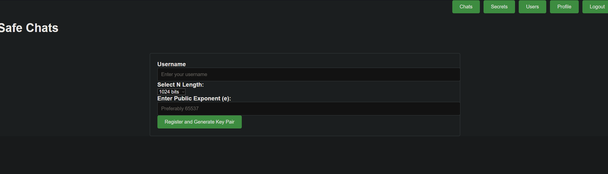

# **Grant Thornton Beginner Quest** - S3cure Chats

**Description**: Bob made a web application to chat with his friends publicly and securely. He put his trust in RSA but he's not sure if his friends know how to use it securely. Can you read their secret message? (There is no web exploitation involved in this challenge)


In this write-up, I'm explaining how I solved the **S3cure Chats** challenge for Grant Thornton Beginner Quest.

# The Challenge: 

Once we Launch An Instance we can see a registration page where we can enter a username and a public Exponent (e). 


I entered a name that is easy to distinguish, I chose the **1024 bits** option for N,  put **65537** as **Public Exponent (e)** and pressed the *Register and Generate Key pair* button.


Now that we registered, we see some messages between *Bob* and his Friends. Reading the messages we see that Bob is explaining to his friends how his app **Encrypts** the messages that are sent.


Next we see that Bob sent the SAME Encrypted message to all his friends and that we can see the Encrypted messages by going to the secrets page.


We visit the *Secrets* page by pressing the button. 


Here we see the Encrypted messages between Bob and his friends.


I try pressing the other buttons and I noticed that we can see  everyone's public key on the *Users* page. Knowing that the **SAME** encrypted message was sent to everyone and  the public key of each person, we can use the **Chinese remainder theorem** to find the original plaintext. If you are interested in learning more about CRT you can read this [wiki](https://en.wikipedia.org/wiki/Chinese_remainder_theorem#:~:text=In%20mathematics%2C%20the%20Chinese%20remainder,are%20pairwise%20coprime%20(no%20two)) page )

# Solution:

First, I entered the **Public Keys** in a text file

and wrote a script to find the **Public Exponent (e)** of the keys. (e=3)

```python
from Crypto.PublicKey import RSA

keys=[]

with open('keys.txt','r') as f:
    keys = f.read()
keys=list(keys.split(','))

for i in keys:
    pub_key=RSA.importKey(i)
    print(pub_key.e)
```


Next, I wrote this script to solve the challenge

```python
from Crypto.Util.number import long_to_bytes as l2b
from gmpy2 import iroot
from libnum import solve_crt #solve_crt(Cs,Ns)
from Crypto.PublicKey import RSA  

keys=[]
Ns=[]
Cs=[]
e=3

  

with open('encrypted.txt','r') as f:
    ct=f.read()
ct=list(ct.split(','))

with open('keys.pub','r') as f:
    keys = f.read()
keys=list(keys.split(','))

  
for i in range(e):
    pub_key=RSA.import_key(keys[i])
    Ns.append(pub_key.n)
    Cs.append(int(ct[i]))
  

a=solve_crt(Cs,Ns)
ans=iroot(a,e)[0]

print(l2b(ans))
```

Using this script we can get the flag

`GTBQ{d0n7_u53_5m4ll_3xp0n3n7_6uy5}`